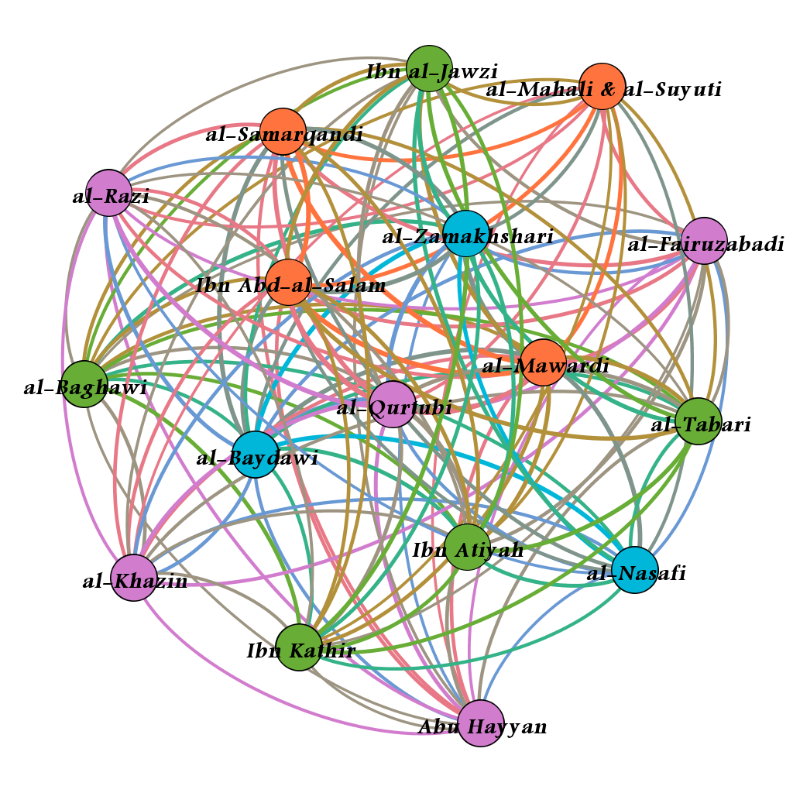

# 1 Introduction

How has Islamic interpretation of the Quran changed over time? Have certain sections of the Quran enjoyed more attention from religious scholars and if so, has preference shifted with time? Does geographic distance equate to divergent preference for scholars who are contemporaneous to one another? Is doctrinal affiliation the primary factor in a *mufassir* (Islamic exegete) giving a section of the Quran more consideration? To answer these questions, we sought out exegetical works that were in a manageable and navigable digital format.

# 2 The Tafāsīr

TODO: DMGize

For reference, the following tafāsīr which ended up being the subject of this document are listed below. Short remarks on each of their authors' biographies will follow.

TODO: If anybody feels like properly capitalizing the titles again, I don't, rigt now. The uppercase letters can be looked up (and then copied and pasted) by clicking on the lowercase letters on https://en.wikipedia.org/wiki/DIN_31635. You could also try https://github.com/sixtyfive/de_dmg/blob/master/windows7810/de_dmg_amd64.msi if you have Windows, but it's quite old and I don't know if it'll still work (but it might).

* *al-baḥr al-muḥīt* by *Abū Ḥayyān*
* *al-ǧāmiʿ li-ʾaḥkām al-qurʾān* by *al-Qurṭubī*
* *al-kaššāf* by *az-Zamaḫšarī*
* *al-muḥarrar al-waǧīz fī tafsīr al-kitāb al-ʾazīz* by *Ibn ʿAṭīya*
* *an-nukat wa-l-ʿuyūn* by *al-Māwardī*
* *anwār at-tanzīl wa-ʾasrār at-taʾwīl* by *al-Bayḍāwī*
* *baḥr al-ʿulūm* by *as-Samarqandī*
* *ǧāmiʿ al-bayān fī tafsīr al-qurʾān* by *aṭ-Ṭabarī*
* *lubāb at-taʾwīl fī maʿānī at-tanzīl* by *al-Ḫāzin*
* *maʿlam at-tanzīl* by *al-Baġawī*
* *madārik at-tanzīl wa-ḥaqa'iq at-taʾwīl* by *an-Nasafī*
* *mafātīḥ al-ġayb* by *ar-Rāzī*
* *tafsīr al-ǧalālayn* by *al-Maḥallī* and *as-Suyūṭī*
* *tafsīr al-qurʾān* by *al-Fayrūzābādī*
* *tafsīr al-qurʾān* by *Ibn ʿAbdi-s-Salām*
* *tafsīr al-qurʾān al-karīm* by *Ibn Kaṯīr*
* *zād al-masīr fī ʿilm at-tafsīr* by *Ibnu-l-Ǧawzī*

# 2 The corpus

As part of an effort to make Islamic scholarship more accessible, the Jordanian-based *Royal Aal al-Bayt Institute for Islamic Thought* commissioned the creation of [altafsir.com](altafsir.com), an online repository of classical works of *tafsīr*. The format of the website allows a user to select a specific *āya* (verse from the Quran) and see the relevant section of *tafsīr* that provides commentary on the *āya*. This structure, along with the fact that the texts are typed in and not photos of scanned pages, made the website ideal for our research which required that the texts be in a digital format and segmented according to the verse that is being commented on. The ultimate goal of [altafsir.com](altafsir.com) is to provide a diverse collection of texts originating from various traditions, sects, and schools of jurisprudence. That desired breadth has yet to be achieved. The website currently has seventeen complete tafāsīr that were all written by *sunnī* (one of the major two sects of Islam) scholars.

# 3 Methodology

Our attempt at determining which verses enjoyed more consideration from the *mufassirūn* began with calculating the word count of every section of the tafsir that was commenting on a specific verse and dividing that number by the total word count of the *tafsīr*. It was our belief that increased attention on a verse was indicative of some sort of importance to the *mufassir*. Importance might not necessarily mean that the *mufassir* had an increased affinity for the values or instructions espoused in the verse. A *mufassir* might have believed that an obscure verse required elucidation to make its message comprehensible to the Muslim layman and therefore devoted more writing to explication and contextualizing.

When we sorted the verses from most written about to least, we observed some suspicious patterns. Consecutive verses were appearing next to one another on the list and they had identical word counts. When we inspected the files in our corpus, we found that there were duplicate chunks of text. The problem was that most of the writers alternated between writing about singles verses and writing about groups of consecutive verses that dealt with a single narrative or theme. If a section of a *tafsīr* covered consecutive verses together, [altafsir.com](altafsir.com) repeated that segment of text when each of those verses were selected on the website. When the script to download the tafāsīr was run, it downloaded the repeated segments of texts and organized them as if they were unique to a single verse. Only three of the writers in the corpus consistently wrote about single verses and therefore did not succumb to the duplicate text problem. Of the 87 *tafsīr* works listed on the website, 69 turned out to be completely empty and one author, *Ibn ʿArafa*, only provided commentary on *sūratān*. Both were removed from the corpus used for analysis, which consequently consists of 17 works comprising $i_{total}=16444304$ words.

We ran a script that looked for duplicate texts and removed any repeated segments. Since we were not able to get word counts for specific verses, we decided to focus on the *sūra* or chapters of the Quran. There is a huge range of *sūra* lengths, with *sūrat al-baqara*, the longest, consisting of 286 verses and *sūrat al-kawṯar*, the shortest, consisting of 3 verses, so looking at how long the commentary was for a specific *sūra* relative to total *tafsīr* length would probably just leave us with something that resembles a list of *sūra*, from longest to shortest. We chose instead to look at length of *tafsīr* commentary divided by the length of the *sūra* it is commenting. We looked at the top twenty-five *suwar* for each *mufassir* and observed that the number of shared *sūra* among the writers of the corpus ranged from twelve to twenty-two. The relationship between the *mufassirūn* was visualized using [Gephi](https://gephi.org/), a free/open-source program used for social network analysis.

## 3.1 The Results



The data as described so far was run through the Gephi social network analysis program. The algorithm calculated four distinct groups, represented as colors in figure 1. They are as follows:

1. Green: *Ibnu-l-Ǧawzī* (d. 597 AH),, *aṭ-Ṭabarī* (d. 310 AH), *Ibn Kaṯīr* (d. 774 AH), *Ibn ʿAṭīya* (d. 546 AH), and *al-Baġawī* (d. 516 AH)
2. Blue: *az-Zamaḫšarī* (d. 538 AH), *al-Bayḍāwī* (d. 685 AH), and *an-Nasafī* (d. 710 AH)
3. Purple: *ar-Rāzī* (d. 606 AH), *al-Fayrūzābādī* (d. 817 AH), *al-Qurṭubī* (d. 671 AH), *al-Ḫāzin* (d. 741 AH), and *Abū Ḥayyān* (d. 754 AH)
4. Orange: *al-Maḥallī* (d. 864 AH) and *as-Suyūṭī* (d. 911 AH), *as-Samarqandī* (d. 375 AH), *al-Māwardī* (d. 450 AH), and *Ibn ʿAbdi-s-Salām* (d. 660 AH)

The unifying characteristic for the exegetes of the first cluster is their reputation as traditionalists. Al-Tabari saw his method of *tafsīr bi-l-maṯūr*, or exclusive reliance on Hadith in matters of Quranic interpretation, as essential to avoid the introduction of *bidʿa* or heretical innovation (@bauer2013). *Al-Baġawī* emphasized the importance of purity in Islamic doctrine and worked to exclude teachings that he believed could not be properly attributed to Muḥammad or the *ṣaḥāba*, the companions of Muḥammad (@ei_albaghawi). Hanbali adherent *Ibnu-l-Ǧawzī* campaigned against the Shia in Iraq and authored a paean[^paean] celebrating the end of Ismaili Fatimid rule in Egypt and the accession of a Sunni, *Ṣalāḥ ad-Dīn*, to power (@mallett). *Ibn ʿAṭīya*'s exegesis received praise from *Ibn Taimīya*, the intellectual forefather of movements that are frequently labeled as Salafist, for its adherence to orthodoxy (@salahi2002). The inclusion of *Ibn Taimīya*'s student *Ibn Kaṯīr* can be attributed to either his conservative leanings—he penned a defense of armed Jihad against neighboring non-Muslim states (@ei_ibnkathir)—or to his *tafsīr* being, as some scholars have observed, a summarized version of *aṭ-Ṭabarī* (@mcauliffe1991).

[^paean]: "a song, film, or piece of writing that praises someone or something very enthusiastically:" (Cambridge Dictionary of English)

TODO: DMGize, mark citations

For the second cluster, geography seems to be the unifying factor. Arabic grammarian and Mu'tazila partisan al-Zamakhshari (McAuliffe, 1991) differed from Hanafi jurist al-Nasafi on matters of doctrine (Poonawala, Wensinck & Heffening, n.d.) but they both lived in the Central Asian region known as Ma wara al-Nahr (Transoxiana) while the Shafi'i al-Baydawi lived in what is now Iran (Krauss-Sánchez, n.d.). Al-Baydawi's exegesis Anwar al-tanzil wa asrar al-ta'wil has been labeled an amended version of al-Zamakhshari's al-Kashshaaf, with Mu'tazila philosophy and other perceived heresies expunged from the text (McAuliffe, 1991). This grouping may reflect a unique Central Asian outlook to the Quran and the addition of al-Baydawi may result from his reliance on the work of al-Zamakhshari. 

TODO: DMGize, mark citations

If there is a latent, unifying factor to the mufasiroon of the third cluster, it is not immediately apparent to us. The exegetes were not contemporaneous to one another with al-Razi preceding al-Fairuzabadi by two centuries. Geography certainly did not connect the writers. Abu Hayyan (Glazer & Homerin, n.d.) and al-Qurtubi were both born in Muslim Spain and ultimately settled in Egypt (Ruano, n.d.). Al-Khazin lived in Syria which also was briefly the home of Persian-born al-Fairuzabadi who also spent his life in Jerusalem, Mecca, and Yemen (Fleisch, n.d.). Al-Razi lived in what is now Iran and Afghanistan (McAuliffe, 1991). In terms of doctrinal leanings, Abu Hayyan was a traditionalist and admirer of Ibn Taymiyyah (Glazer & Homerin, n.d.) while al-Razi, though ostensibly a critic of Mu'tazila theology, is seen to have incorporated heterodox tenets emphasizing reason and ta'wil or figurative reading in Quranic interpretation (Jaffer, 2015). Unfortunately, the inability to obtain word counts at the verse-level and therefore our inspection at the chapter-level may have adversely affected the quality of the groupings calculated by Gephi.

TODO: DMGize, mark citations

The last cluster of our analysis resulted in a predictable grouping of exegetes. The primary characteristic that unified these authors was their choice of school of jurisprudence. Although these exegetes were all from different time periods and, for the most part, varying geographical locations the analogous school of thought when approaching the interpretations of the Quran was similar enough to differentiate this group from the rest of our corpus. Amongst the four authors in this cluster three were from the school of Shafi'i and one from the school of Hanafi.

TODO: DMGize, mark citations

Al–Mawardi was an Islamic jurist born in Basra, Iraq during 364AH (Sharif, 2002). During his time he was considered a high profile figure appointed with various significant responsibilities, including serving as a diplomat for the caliphate and eventually appointed chief Iman of Baghdad (Zahoor, 1998) . The cities where al-mawari lived where known to be hubs of the Mu'tazaila school of thought, so some found it peculiar that the chief qadi of Baghdad (known hub of Mu'tazaila jurisprudence) was in fact associated with the Shafi'i school of thought. He was later condemned for his Mu'tazila sympathies. Al-Mawardi was known for his works in islamic legal principles, in fact in 429 AH the caliph Al-Qadir summoned four jurist from each school of jurisprudence to write a legal epitome.(Sharif, 2002) Al-Mawardi was chosen to represent the school of Shafi'i. Amongst the four jurist the Caliph favored Al-Mawardi and appointed chief imam. (Sharif, 2002) Along with the school of jurisprudence a common factor amongst most of the authors was their interest or relation in Islamic law. 

TODO: DMGize, mark citations

Ibn 'Abd al-Salam was born in Damascus in year 577AH(Salahi) much after Abu al-Layth Al Samarqandi and Al–Mawardi. During his time he was the leading authority in the Shafi'i Jurisprudence and most famous for his interpretations of Islamic legal principles. Unlike al mawari ,Abd al-Salam was known to be defiant of customs he deemed “unsanctioned”. He even went as far as condemning those who follow these unsanctioned customs regardless of status; most notably the ruler of Damascus As-Salih Ismail.(Jackson, 1996) This condemning led to his imprisonment and eventual emigration to Cairo, Egypt. In Cairo he was credited as the first jurist to teach Quranic commentary in Egypt. (Salahi) Like Al-Mawardi, Al- Salam was a world renowned scholar of fatwas. Al-salam was so respected, islamic jurist like al-Hafiz al-Mundhiri stopped giving fatwas stating "It does not behove any jurist to give a fatwa where Izz al-Din(Ibn 'Abd al-Salam) happens to be present."(Salahi) Both Ibn 'Abd al-Salam and Al-Mawardi were highly respected scholars of their time especially in regards to islamic law. Both authors were advisors to their respected islamic governments of their time,(Jackson, 1996) another factor which may have attributed to the groups of these authors in the same cluster. 

TODO: DMGize, mark citations

Jalal al-Din al-Suyuti was born in Cario, Eygpt in the year 849AH (al-Suyuti, 2007) making his work the most recent amongst the cluster. Like most authors in the cluster he was a islamic jurist from the school of shafi'i. He was acknowledged as one of the more recent authority of the Shafi'i school whose degree of ijthad was accepted by most(Meri,2005). Jalal al-Din al-Suyuti lacked a particular interest in islamic law and was not known to be a head advisor for any Islamic governments like both Ibn 'Abd al-Salam and Al-Mawardi. Although his father being a judge of a islamic state may have influenced any emphasis on law(islamic) within his writings and thus placing him within this cluster.(al-suyuti,2007) Unlike the other authors, al-Suyuti also studied the Hanafi school of jurisprudence and was tutored by a Sufi, though his work drew primarily from shafi'i school of thought. Al-Suyuti's interest in the Hanafi jurisprudence may account for the inclusion of Abu al-Layth Al Samarqandi in our cluster. 

TODO: DMGize, mark citations

Abu al-Layth al-Samarqandi author of Bahr Ul ‘Ulum was the single author in the cluster from the school of Hanafi. Apart from his jurisprudence another outlying factor for al-Samaraqandi was his geographical location and time period. He was born in Afghanistan during 373AH making him the oldest exegete in this cluster. (wheeler, 2002) Since his worked dated back so far we were unable to find much information in regards to his lifestyle or any other factors that may have attributed to his placing in this cluster although, however we were able to compile a few specific features of his exegesis. In his work of the Quran al-samarqandi was known to relate the stories of sahabah and other hadiths from people not proven to be 100% reliable. He was also known for his lack of interest in the various methods of recitation (Qira'at).(“Liste..” 2002) Unfortunately, due to lack of information on Al Samarqandi we were unable to pinpoint a specific factor that attributed to his grouping in this cluster, for now he remains an outlier.

TODO: DMGize, mark citations

From the results of the study, we cannot definitively state that focusing on certain aspects of the Quran is determined principally by any of the factors mentioned at the beginning of the paper (chronology, geography, dogma). However, we believe that examination of surah and ayah preference from Quranic exegetes deserves further exploration.

# Appendix

Note on source code formatting: as this document was prepared using the `rmarkdown` package, consequently `knitr`'s built-in devices are being used to include our source code in the below appendices for reference. Unfortunately, it has not yet evolved to a point where it knows how to properly break-around longer lines as they often appear in source code files. The reader is kindly asked to open the source code files directly from [the GitHub repository where they are being kept](https://github.com/Islamicate-DH/hw/tree/master/tafaseer_group) if they wish to read them in detail. Towards that end, the appendix subheadings provide direct links to the files.

Note on placement of appendix and references: another limitation of using Rmarkdown for scientific documents is the placement of references at the end of the document and nowhere else. This can only be worked around by use of a modified template file as described in [the Rmarkdown documentation's comment section](http://rmarkdown.rstudio.com/authoring_bibliographies_and_citations.html). Unfortunately, time constraints didn't allow creation of such a template for this document.

```{r, echo=FALSE}
library(knitr)
opts_chunk$set(tidy.opts = list(width.cutoff=60, indent=2), tidy=TRUE)
```

# I Script [`01_retrieval/download.r`](https://github.com/Islamicate-DH/hw/tree/master/tafaseer_group/01_retrieval/download.r)

```{r, code=readLines('../01_retrieval/download.r'), eval=FALSE}
```

# II Script [`01_retrieval/extract.r`](https://github.com/Islamicate-DH/hw/tree/master/tafaseer_group/01_retrieval/extract.r)

```{r, code=readLines('../01_retrieval/extract.r'), eval=FALSE}
```

# III Script [`01_retrieval/process.rb`](https://github.com/Islamicate-DH/hw/tree/master/tafaseer_group/01_retrieval/process.rb)

```{ruby, code=readLines('../01_retrieval/process.rb'), eval=FALSE}
```

# IV Script [`01_retrieval/convert.rb`](https://github.com/Islamicate-DH/hw/tree/master/tafaseer_group/01_retrieval/convert.rb)

```{ruby, code=readLines('../01_retrieval/convert.rb'), eval=FALSE}
```

# V Script [`02_analysis/wordcount_by_author.rb`](https://github.com/Islamicate-DH/hw/tree/master/tafaseer_group/02_analysis/wordcount_by_author.rb)

```{ruby, code=readLines('../02_analysis/wordcount_by_author.rb'), eval=FALSE}
```

# VI Query [`02_analysis/wordcount_whole_corpus.sql`](https://github.com/Islamicate-DH/hw/tree/master/tafaseer_group/02_analysis/wordcount_whole_corpus.sql)

```{sql, code=readLines('../02_analysis/wordcount_whole_corpus.sql'), eval=FALSE}
```
# 4 References

TODO: Keep moving them into Biblatex file, keep referencing properly in the text.

"Al-Suyuti." Encyclopedia Britannica Online. May 16, 2007. Accessed December 1, 2016. https://www.britannica.com/biography/al-Suyuti.

Bastian M., Heymann S., Jacomy M. (2009). Gephi: an open source software for exploring and manipulating networks. International AAAI Conference on Weblogs and Social Media

Delfina Serrano Ruano, “al-Qurṭubī”, in: Encyclopaedia of the Qurʾān, General Editor: Jane Dammen McAuliffe, Georgetown University, Washington DC. Retrieved From http://www.brillonline.com

Fleisch, H., “al-Fīrūzābādī”, in: Encyclopaedia of Islam, Second Edition, Edited by: P. Bearman, Th. Bianquis, C.E. Bosworth, E. van Donzel, W.P. Heinrichs. Retrieved From http://www.brillonline.com

Glazer, Sidney and Homerin, Th. Emil, “Abū Ḥayyān al-Gharnāṭī”, in: Encyclopaedia of Islam, THREE, Edited by: Kate Fleet, Gudrun Krämer, Denis Matringe, John Nawas, Everett Rowson. Retrieved from http://www.brillonline.com

Jackson, Sherman A(1996). Islamic law and the state: the constitutional jurisprudence of Shihāb al-Dīn al-Qarāfī. Leiden: E.J. Brill, 1996.

Jaffer, Tariq (2015). Razi: Master of Qur'anic Interpretation and Theological Reasoning. New York, NY: Oxford University Press.

Krauss-Sánchez, Heidi R., “al-Baydāwī”, in: Encyclopedia of the Medieval Chronicle, Edited by: Graeme Dunphy, Cristian Bratu. First Published online 2016. Retrieved
From http://www.brillonline.com

"Liste des compagnies aériennes par pays." (2011) Wikipedia. Accessed December 1, 2016. https://fr.wikipedia.org/wiki/Liste_des_compagnies_a%C3%A9riennes_par_pays.

Meri, Josef W., ed. (2005). "Suyuti, Al-, 'Abd al-Rahman". Medieval Islamic Civilization: An Encyclopedia. Routledge. pp. 784–786.

Poonawala, I., Wensinck, A.J. and Heffening, W., “al-Nasafī”, in: Encyclopaedia of Islam, Second Edition, Edited by: P. Bearman, Th. Bianquis, C.E. Bosworth, E. van Donzel, W.P. Heinrichs. Retrieved from http://www.brillonline.com

Sharif , M M. "Al-MĀWARDĪ." Encyclopaedia of Islam, Second Edition1, no. 3 (August 8, 2002). Accessed December 1, 2016. doi:10.1163/1573-3912_islam_com_0713.

Wheeler, Brannon M. Prophets in the Quran: an introduction to the Quran and Muslim exegesis. London: Continuum, 2002.
pg 337

Zahoor, A., Dr. "Al-Mawardi, 972-1058 C.E." Al-Mawardi, 972-1058 C.E. January 15, 1998. Accessed December 1, 2016. http://www.unhas.ac.id/rhiza/arsip/saintis/mawardi.html.
