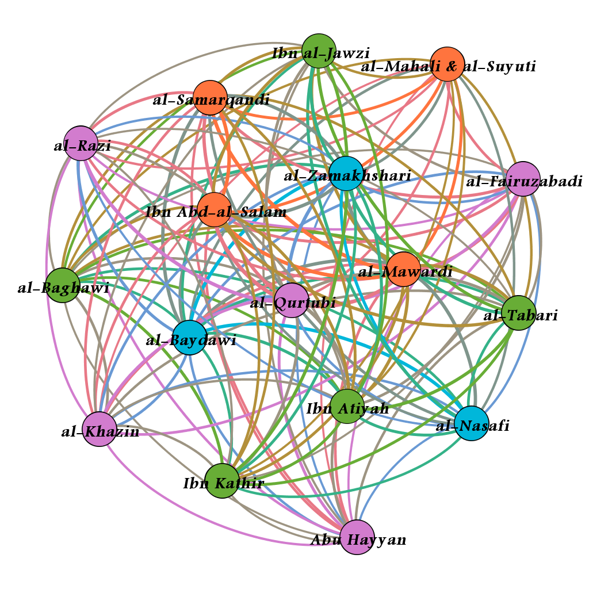

***

# 1 Introduction

How has Islamic interpretation of the Quran changed over time? Have certain sections of the Quran enjoyed more attention from religious scholars and if so, has preference shifted with time? Does geographic distance equate to divergent preference for scholars who are contemporaneous to one another? Is doctrinal affiliation the primary factor in a *mufassir* (Islamic exegete) giving a section of the Quran more consideration? To answer these questions, we sought out exegetical works that were in a manageable and navigable digital format.

## 1.1 A note on transliteration

The transliteration system used is that of the German Oriental Society[^dmg]. We have tried to be consistent in our transliteration of Arabic words (and sometimes Persian names). For the inconsistencies that remain[^inconsistencies] we ask the reader's digression. As regards diphtongs we have opted towards the variant employing the combination of consonant plus vowel which we feel best evokes a "closer-to-correct" pronounciation in readers not trained in Arabic. Proper names were transliterated starting with capital letters only at the beginning of a sentence or if they are a person's or a place's name. Words that have found their way into English[^englishwords], and which the reader can be assumed to be familiar with, were only transliterated if belonging to a group of other Arabic words.

[^dmg]: *Deutsche Morgenländische Gesellschaft* in the original. A copy of the latest transliteration rules anno 1969 is available from [http://www.dmg-web.de/pdf/Denkschrift.pdf](http://www.dmg-web.de/pdf/Denkschrift.pdf).

[^englishwords]: Such as Quran, Sunni, Shia, Fatimid, etc.

[^inconsistencies]: Mostly, vowelisation was sometimes added where it helps the flow of pronounciation.

## 1.2 A technical note regarding this document

The present document was prepared using the `rmarkdown`[^rmarkdown] package and consequently `knitr`'s[^knitr] built-in devices are being used to include the source code relevant to this study in the appendix. Unfortunately, the underlying libraries have not yet evolved to a point where they know how to properly break-around longer lines as they often appear in source code files. The reader is kindly asked to open the source code files directly from the GitHub repository where they are being kept[^github] if she wishes to read them in detail. Towards that end, the appendix subheadings provide direct links to the respective files displayed beneath them.

[^rmarkdown]: [http://rmarkdown.rstudio.com/](http://rmarkdown.rstudio.com/)

[^knitr]: [http://yihui.name/knitr/](http://yihui.name/knitr/)

[^github]: [https://github.com/Islamicate-DH/hw/tree/master/tafaseer_group](https://github.com/Islamicate-DH/hw/tree/master/tafaseer_group)

# 2 The corpus

As part of an effort to make Islamic scholarship more accessible, the Jordanian-based *Royal Aal al-Bayt Institute for Islamic Thought* commissioned the creation of [altafsir.com](altafsir.com), an online repository of classical works of *tafsīr*. The format of the website allows a user to select a specific *āya* (verse from the Quran) and see the relevant section of *tafsīr* that provides commentary on the *āya*. This structure, along with the fact that the texts are typed in and not photos of scanned pages, made the website ideal for our research which required that the texts be in a digital format and segmented according to the verse that is being commented on. The ultimate goal of [altafsir.com](altafsir.com) is to provide a diverse collection of texts originating from various traditions, sects, and schools of jurisprudence. That desired breadth has yet to be achieved. The website currently has seventeen complete tafāsīr that were all written by *sunnī* (one of the major two sects of Islam) scholars.

## 2.1 The tafāsīr

The following *tafāsīr* which ended up being the subject of our work are listed below. Short remarks on some of their authors' biographies will follow in section 3.2.

* *al-baḥr al-muḥīt* by *Abū Ḥayyān*
* *al-ǧāmiʿ li-ʾaḥkām al-qurʾān* by *al-Qurṭubī*
* *al-kaššāf* by *az-Zamaḫšarī*
* *al-muḥarrar al-waǧīz fī tafsīr al-kitāb al-ʾazīz* by *Ibn ʿAṭīya*
* *an-nukat wa-l-ʿuyūn* by *al-Māwardī*
* *anwār at-tanzīl wa-ʾasrār at-taʾwīl* by *al-Bayḍāwī*
* *baḥr al-ʿulūm* by *as-Samarqandī*
* *ǧāmiʿ al-bayān fī tafsīr al-qurʾān* by *aṭ-Ṭabarī*
* *lubāb at-taʾwīl fī maʿānī at-tanzīl* by *al-Ḫāzin*
* *maʿlam at-tanzīl* by *al-Baġawī*
* *madārik at-tanzīl wa-ḥaqa'iq at-taʾwīl* by *an-Nasafī*
* *mafātīḥ al-ġayb* by *ar-Rāzī*
* *tafsīr al-ǧalālayn* by *al-Maḥallī* and *as-Suyūṭī*
* *tafsīr al-qurʾān* by *al-Fayrūzābādī*
* *tafsīr al-qurʾān* by *Ibn ʿAbd as-Salām*
* *tafsīr al-qurʾān al-karīm* by *Ibn Kaṯīr*
* *zād al-masīr fī ʿilm at-tafsīr* by *Ibnu-l-Ǧawzī*

# 3 Methodology

Our attempt at determining which verses enjoyed more consideration from the *mufassirūn* began with calculating the word count of every section of the *tafsīr* that was commenting on a specific verse and dividing that number by the total word count of the *tafsīr*. It was our belief that increased attention on a verse was indicative of some sort of importance to the *mufassir*. Importance might not necessarily mean that the *mufassir* had an increased affinity for the values or instructions espoused in the verse. A *mufassir* might have believed that an obscure verse required elucidation to make its message comprehensible to the layman Muslim and therefore devoted more writing to explication and contextualizing.

When we sorted the verses from most written about to least, we observed some suspicious patterns. Consecutive verses were appearing next to one another on the list and they had identical word counts. When we inspected the files in our corpus, we found that there were duplicate chunks of text. The problem was that most of the writers alternated between writing about singles verses and writing about groups of consecutive verses that dealt with a single narrative or theme. If a section of a *tafsīr* covered consecutive verses together, [altafsir.com](altafsir.com) repeated that segment of text when any one of those verses were selected on the website. When the script to download the *tafāsīr* was run, it downloaded the repeated segments of texts and organized them as if they were unique to a single verse. Only three of the writers in the corpus consistently wrote about single verses and therefore did not succumb to the duplicate text problem. Of the 87 *tafsīr* works listed on the website, 69 turned out to be completely empty and one author, *Ibn ʿArafa*, only provided commentary on *sūratān*. Both were removed from the corpus used for analysis, which consequently consists of 17 works comprising $i_{total}=16444304$ words.

After trying a number of different data formats for working with the corpus, we settled on importing it into a relational database table which enabled us to perform queries either detailled or broad on it without necessarily having to write any logic. To give an example, the following SQL query would return *az-Zamaḫšarī*'s commentary on the fourth verse of the famous *sūrat al-iḫlāṣ* together with a simple character count:

\singlespacing
```{r, code=readLines('decoy.sql'), eval=FALSE}
```
\doublespacing

We built a chain of queries first excluding duplicate texts and subsequently any repeat segments. Appendix VI shows the full chain of queries which led to the CSV file that was then imported into a spreadsheet program to continue manually preparing it for network analysis. Because of the way most of the authors structure their commentary on the Quran, we were not able to get word counts for single verses/*āyāt*, and so decided to focus on the chapters/*suwar*. There is a huge range of *sūra* lengths, with *sūrat al-baqara*, the longest, consisting of 286 verses and *sūrat al-kawṯar*, the shortest, consisting of 3 verses, so looking at how long the commentary was for a specific *sūra* relative to total *tafsīr* length would probably just leave us with something that resembles a list of *suwar*, from longest to shortest. We chose instead to look at length of *tafsīr* commentary divided by the length of the *sūra* it is commenting. We looked at the top twenty-five *suwar* for each *mufassir* and observed that the number of shared *suwar* among the writers of the corpus ranged from twelve to twenty-two.

The relationship between the *mufassirūn* was visualized using Gephi[^gephi], a free/open-source program used for social network analysis. Each writer is represented as a "node" on the graph.  An "edge" is a connection between nodes which for our research is a *sūra* from the list of twenty-five that is shared by writers. A connection is weighted for each additional, shared *sūra* so that the connection between writers who share numerous *suwar* is stronger than the connection between those who share few. Gephi has a modularity function that defines sub-networks which we believed could show which of the writers of the corpus were similar in the manner that they gave certain *suwar* more attention. What resulted from the calculation was the clustering of the *mufassirūn* into four groups.

[^gephi]: [https://gephi.org/](https://gephi.org/)

## 3.1 The results



Gephi's algorithm calculated four distinct groups, represented as colors in figure 1. They are as follows:

1. Green: *Ibnu-l-Ǧawzī* (d. 597 AH), *aṭ-Ṭabarī* (d. 310 AH), *Ibn Kaṯīr* (d. 774 AH), *Ibn ʿAṭīya* (d. 546 AH), and *al-Baġawī* (d. 516 AH)
2. Blue: *az-Zamaḫšarī* (d. 538 AH), *al-Bayḍāwī* (d. 685 AH), and *an-Nasafī* (d. 710 AH)
3. Purple: *ar-Rāzī* (d. 606 AH), *al-Fayrūzābādī* (d. 817 AH), *al-Qurṭubī* (d. 671 AH), *al-Ḫāzin* (d. 741 AH), and *Abū Ḥayyān* (d. 754 AH)
4. Orange: *al-Maḥallī* (d. 864 AH) and *as-Suyūṭī* (d. 911 AH), *as-Samarqandī* (d. 375 AH), *al-Māwardī* (d. 450 AH), and *Ibn ʿAbd as-Salām* (d. 660 AH)

The unifying characteristic for the exegetes of the first cluster is their reputation as traditionalists. *Aṭ-Ṭabarī* saw his method of *tafsīr bi-l-maṯūr*, or exclusive reliance on *ḥadīṯ* (accounts on the life of the prophet Muḥammad) in matters of Quranic interpretation, as essential to avoid the introduction of *bidʿa* or heretical innovation (@bauer2013). *Al-Baġawī* emphasized the importance of purity in Islamic doctrine and worked to exclude teachings that he believed could not be properly attributed to Muḥammad or the *ṣaḥāba*, the companions of Muḥammad (@ei_albaghawi). *Ḥanbalī* adherent *Ibnu-l-Ǧawzī* campaigned against the Shia in Iraq and authored a paean[^paean] celebrating the end of *ismaʿīlī* Fatimid rule in Egypt and the accession of a Sunni, *Ṣalāḥ ad-Dīn*, to power (@mallett). *Ibn ʿAṭīya*'s exegesis received praise from *Ibn Taimīya*, the intellectual forefather of movements that are frequently labeled as Salafist, for its adherence to orthodoxy (@salahi2002). The inclusion of *Ibn Taimīya*'s student *Ibn Kaṯīr* can be attributed to either his conservative leanings—he penned a defense of armed jihad against neighboring non-Muslim states (@ei_ibnkathir)—or to his *tafsīr* being, as some scholars have observed, a summarized version of *aṭ-Ṭabarī* (@mcauliffe1991).

[^paean]: "[A] song, film, or piece of writing that praises someone or something very enthusiastically:" (Cambridge Dictionary of English)

For the second cluster, geography seems to be the unifying factor. Arabic grammarian and *muʿtazila* partisan *az-Zamaḫšarī* (@mcauliffe1991) differed from *ḥanafī* jurist *an-Nasafī* on matters of doctrine (@ei_annasafi) but they both lived in the Central Asian region known as *mā warāʾu-n-nahr* (Transoxiana) while the šāfiʿī *al-Bayḍāwī* lived in what is now Iran (@emc_albaydawi). *Al-Bayḍāwī*'s exegesis *anwār at-tanzīl wa-ʾasrār at-taʾwīl* has been labeled an amended version of *az-Zamaḫšarī*'s *al-kaššāf*, with *muʿtazila* philosophy and other perceived heresies expunged from the text (@mcauliffe1991). This grouping may reflect a unique Central Asian outlook to the Quran and the addition of *al-Bayḍāwī* may result from his reliance on the work of *az-Zamaḫšarī*.

If there is a latent, unifying factor to the *mufassirūn* of the third cluster, it is not immediately apparent to us. The exegetes were not contemporaneous to one another with *ar-Rāzī* preceding *al-Fayrūzābādī* by two centuries. Geography certainly did not connect the writers. *Abū Ḥayyān* (@ei_abuhayyan) and *al-Qurṭubī* were both born in Muslim Spain and ultimately settled in Egypt (Ruano, n.d.). *Al-Ḫāzin* lived in Syria which also was briefly the home of Persian-born *al-Fayrūzābādī* who also spent his life in Jerusalem, Mecca, and Yemen (@ei_alfiruzabadi). *ar-Rāzī* lived in what is now Iran and Afghanistan (@mcauliffe1991). In terms of doctrinal leanings, *Abū Ḥayyān* was a traditionalist and admirer of *Ibn Taimīya* (@ei_abuhayyan) while *ar-Rāzī*, though ostensibly a critic of *muʿtazila* theology, is seen to have incorporated heterodox tenets emphasizing reason and *taʾwīl* or figurative reading in Quranic interpretation (Jaffer, 2015). Unfortunately, the inability to obtain reliable word counts at the verse-level (and therefore our inspection at the chapter-level) may have adversely affected the quality of the groupings calculated by Gephi.

The last cluster of our analysis resulted in a predictable grouping of exegetes. The primary characteristic that unified these authors was their choice of school of jurisprudence. These exegetes were all from different time periods and, for the most part, varying geographical locations yet still their analogous school of thought when approaching the interpretations of the Quran was similar enough to differentiate this group from the rest of our corpus. Amongst the four authors in this cluster three were from the school of *aš-Šāfiʿī* and one from the school of *al-Ḥanafī*.

Along with school of jurisprudence, a common factor amongst most of the authors was their interest in or relation to Islamic Law.

## 3.2 Remarks on noteworthy authors of works in the corpus after network analysis

*Al-Māwardī* was an Islamic jurist born in Basra, Iraq during 364 AH (@ei_almawardi). During his time he was considered a high profile figure appointed with various significant responsibilities, including serving as a diplomat for the caliphate and eventually appointed chief Imam of Baghdad (@zahoor1998) . The city where *al-Māwardī* lived was known to be a hub of the *muʿtazila* school of thought, so some found it peculiar that its chief Imam was in fact associated with the šāfiʿī school of thought. He was later condemned for his *muʿtazila* sympathies. *Al-Māwardī* was known for his works in Islamic legal principles, in fact in 429 AH the caliph *al-Qādir* summoned four jurists from each school of jurisprudence to write a legal epitome (@ei_almawardi). *Al-Māwardī* was chosen to represent the school of *aš-Šāfiʿī*. Amongst the four jurists the Caliph favored *al-Māwardī* and appointed him chief Imam (@ei_almawardi).

*ʿIzz ad-Dīn ibn ʿAbd as-Salām* was born in Damascus in the year 577 AH (@salahi2016), long after *as-Samarqandī* and *al-Māwardī*. During his time he was the leading authority in the *šāfiʿī* jurisprudence and most famous for his interpretations of Islamic legal principles. Unlike *al-Māwardī*, *ʿAbd as-Salām* was known to be defiant of customs he deemed "unsanctioned". He even went as far as condemning those who follow these unsanctioned customs regardless of status; most notably the ruler of Damascus, *aṣ-Ṣāliḥ ʾIsmaʿīl* (@jackson1996). This condemning led to his imprisonment and eventual emigration to Cairo, Egypt. There, he was credited as the first jurist to teach Quranic commentary in Egypt (@salahi2016). Like *al-Māwardī*, *as-Salām* was a world renowned scholar of *fatāwa* (sg. *fatwa*, a document of legal opinion in Islamic Law). Indeed, *as-Salām* was so respected, Islamic jurists like *al-Ḥāfiẓ al-Munḏirī* stopped giving *fatāwa* stating that "[i]t does not behove any jurist to give a *fatwa* where *ʿIzz ad-Dīn* [*Ibn ʿAbd as-Salām*] happens to be present" (@salahi2016). Both *Ibn ʿAbd as-Salām* and *al-Māwardī* were highly respected scholars of their time especially in regards to Islamic Law. Both authors were advisors to respected Islamic governments of their time (@jackson1996), another factor which may have attributed to the grouping of these authors in the same cluster.

Where *ʿAbd as-Salām* died, much later *Ǧalāl ad-Dīn as-Suyūṭī* was born in the year 849 AH (@eb_alsuyuti), making his work the most recent here mentioned. Like most authors in the cluster he was an Islamic jurist from the school of *aš-Šāfiʿī*. He was acknowledged as one of the more recent authorities of the *šāfiʿī* school whose degree of *iǧtihād* was "accepted by most" (@mic_alsuyuti). *As-Suyūṭī* lacked a particular interest in Islamic Law and was not known to be a head advisor for any Islamic government like both *Ibn ʿAbd as-Salām* and *al-Māwardī* had been. Although his father having been a judge of an Islamic state may have influenced any emphasis on the (Islamic) law within his writings and thus placing him within this cluster (@eb_alsuyuti). Unlike the other authors, *as-Suyūṭī* also studied the *ḥanafī* school of jurisprudence and was tutored by a Sufi, though his work drew primarily from the *šāfiʿī* school of thought. *As-Suyūṭī*'s interest in the *ḥanafī* jurisprudence may account for the inclusion of *as-Samarqandī* in the cluster.

*Abu-l-Layṯ as-Samarqandī*, author of *baḥr al-ʿulūm* was the single author in the cluster from the school of *al-Ḥanafī*. Apart from his jurisprudence another outlying factor for *as-Samarqandī* was his geographical location and time period. He was born in Afghanistan during 373 AH making him the oldest exegete in this cluster (@wheeler2002 [p. 337]). Since his work dated back so far we were unable to find much information as regards his lifestyle or any other factors that may have attributed to his placing in this cluster. We were however able to compile a few specific features of his exegesis: in his work on the Quran, *as-Samarqandī* was known to relate the stories of *ṣaḥāba* and of other *ḥadīṯ* from people not proven to be entirely reliable. He was also known for his lack of interest in the various *qirāʾāt*, the methods of recitation of the Quran (@wpfr_tafsirsamarqandi). Unfortunately, due to lack of information on *as-Samarqandī* we were unable to pinpoint a specific factor that would explain his grouping in the fourth, or orange cluster. For the time being he remains an outlier.

# 4 Conclusion

From the results of the study we cannot definitively state that focusing on certain aspects of the Quran is determined principally by any of the factors mentioned at the beginning of this paper (chronology, geography or dogma). It is our contention that examining commentaries that are able to be divided up at the verse-level should yield clearer, more consistent clusters. There was a surprisingly large degree of overlap among the lists of top twenty-five *suwar*. Shorter *suwar* may require more commentary simply because their laconic nature demands contextualizing and therefore their placement at the top of the lists reveals little about the attention *mufassirūn* gave to certain sections of the Quran.

What this research did was attempt to explore  a new method of charting the relationships of Quranic scholars that rely on an impartial, distant examination of *tafāsīr* that traditional categorization--according to sect or school of jurisprudence--may lack. The results were not as conclusive as we had hoped, however, we believe that examination of *sūra* and *āya* preferences of Quranic exegetes deserves further exploration.

# 5 References

\singlespacing
